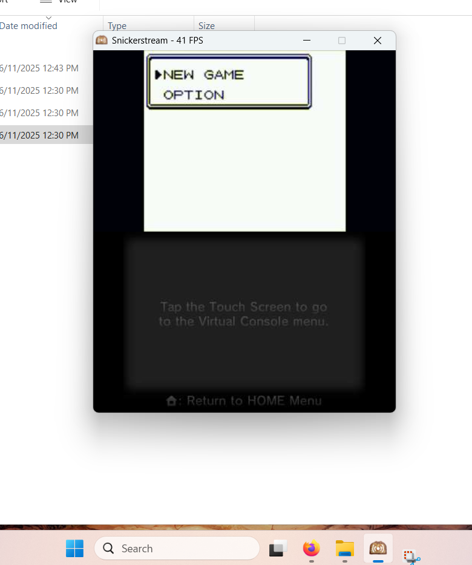
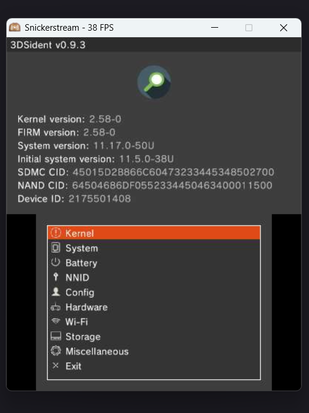
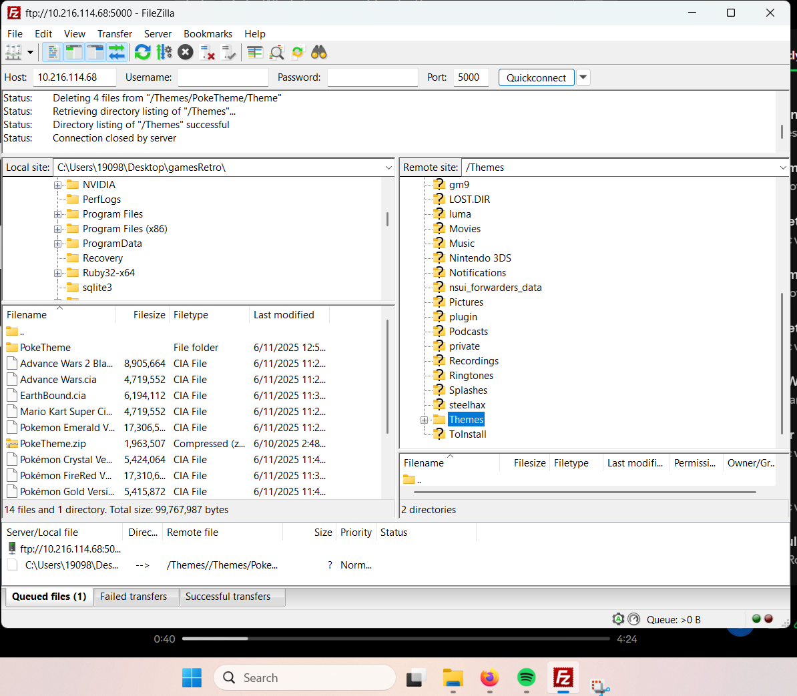
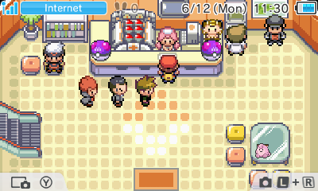
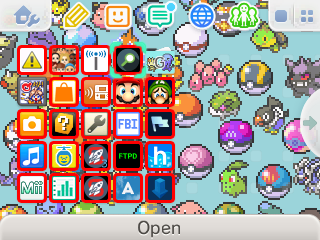
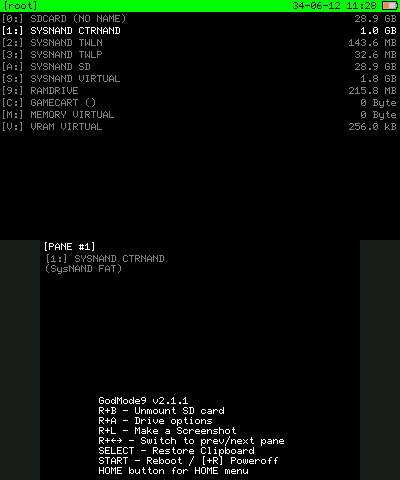

#  Jorge Hernandez - B.S. Computer Science 

-----

Welcome! This is where I update tech/work related information. If you'd like a quick overview of me, take a look at this main page.

## Short Bio

 * B.S. degree in Computer Science from UC San Diego, from one of the top programs in the nation (ranked yearly in or near the top 10 of the USA). I developed solid technical and theoretical skills,using popular and widely used languages like C++, Java, JavaScript and SQL for projects and homeworks. My main interests in college were web development, databases and computer security. I’m fluent in both Spanish and English, learn new technologies and adapt to workflows quickly, and I consistently performed well in technical assessments during my time as an undergraduate.

 ## Latest Completed Project

 ### Custom Nintendo 3DS Modding & Streaming (Independent Project)

 *Personal project showcasing embedded system modding and FTP/NTR streaming setup.*
***Topics**: Homebrew modding, embedded system interfacing, and file system manipulation on legacy hardware.*

#### Project Overview

I desgined and installed a fully custom Pokémon-themed UI for a modded New 3DS, complete with original backgrounds, custom icon layout, and a background track ripped straight from Pokémon Fire Red/Leaf Green.

The project involved deep interaction with legacy hardware, system-level modding tools, and network-based file transfers between my PC and 3DS — including recovery from a softbrick caused by a corrupted theme audio file.

* Designed and deployed a fully custom Nintendo 3DS theme using a graphics editor, YATA+, Anemone3DS, and BCSTM audio conversion, including graphic and audio asset integration.

* Configured FTP and file transfer pipelines between PC and 3DS via ftpd; resolved permission and format issues during installation.

* Enabled real-time 3DS-to-PC streaming using NTR CFW and Snickerstream, optimizing latency and video quality for gameplay footage.

* Diagnosed and fixed boot issues caused by theme bugs (e.g. mono audio incompatibility), troubleshooting through GodMode9 file system.

#### Tools Used

* YATA+
	- Theme creation, BGM & background injection
* Anemone3DS
	- Theme installer on 3DS
* ftpd	
   - FTP file transfers over local network
* NTR CFW
   - Custom firmware for streaming
* Snickerstream
   - PC-side receiver for 3DS video
* GodMode9
   - File system access and system repair

#### What I Learned

    Navigating under-documented tools and legacy file formats

    Handling embedded system file structures and data recovery

    Creating audio loops and using compression tools for game BGM, along custom user interfaces.

    Writing clean, portable ZIP structures compatible with homebrew loaders

#### Gallery

> Snickerstream showing both the 3DS screens on the PC.

>  Look up important info. about yout system that is mostly hidden to users before modding.

> FTP connection between the PC and the console, you can add your own security for safer data transmission.

> Part 1 of the custom theme I created on a Graphics Editor, running on the 3DS upper screen.

> Part 2 of the custom theme I created, running on the 3DS lower screen. You can notice a custom folder sprite labeled "G" with the famous Meowth and Wobbuffet pair.

> Godmode9 provides a very useful interface for experienced users. This screenshot was taken on the console itself.

## Notes
   
   * This website is written in [Markdown](https://en.wikipedia.org/wiki/Markdown) and a little regular HTML
